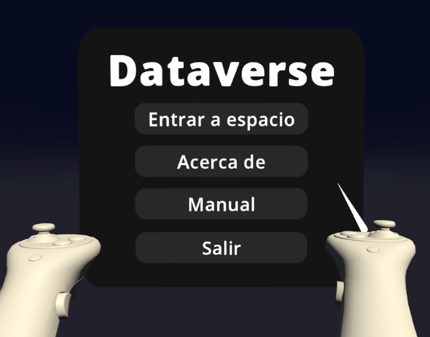
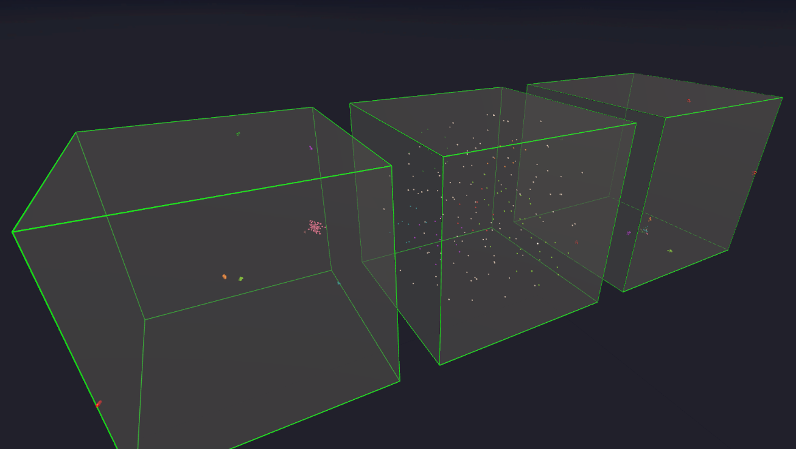
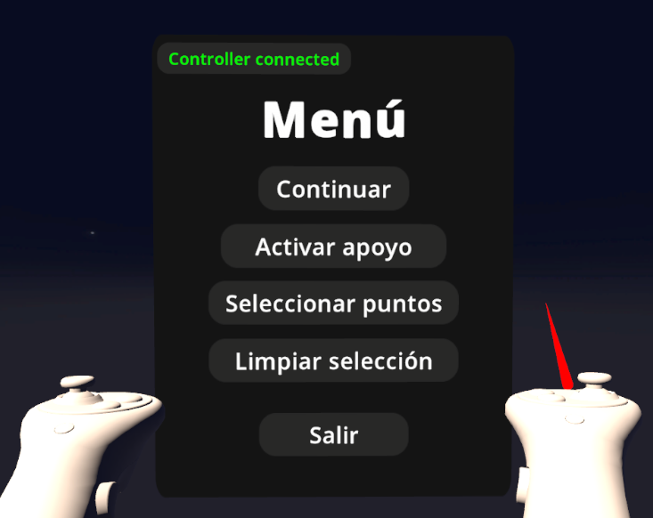
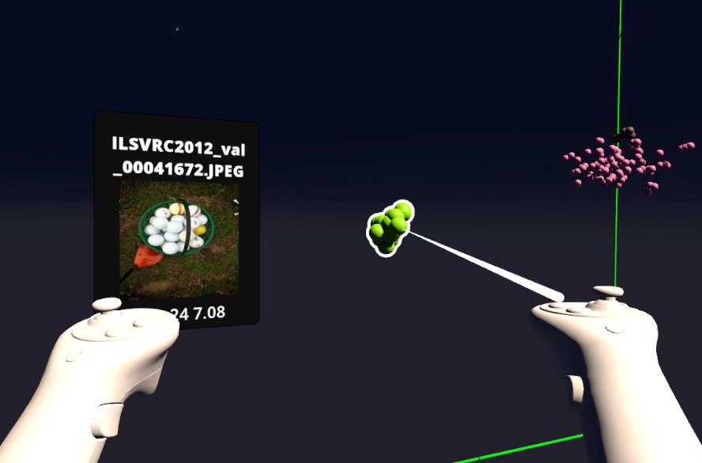
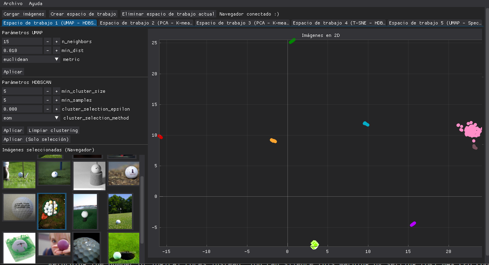

# Dataverse: Una aplicación colaborativa para visualización y clustering de datos

Proyecto de una aplicación de realidad virtual utilizando unity y Oculus Rift. Este proyecto se realizó como parte del trabajo del curso de Interacción Humano Computador del programa de ciencia de la computación en la Universidad Católica San Pablo (UCSP). En este repositorio se encuentra la aplicación para el usuario navegador, la parte del usuario controlador puede ser encontrada en el repositorio: <https://github.com/joaquin30/dataverse-controller>

## Integrantes del equipo
- Bruno Fernandez Gutierrez (bruno.fernandez@ucsp.edu.pe)
- Joaquin Pino Zavala (joaquin.pino@ucsp.edu.pe)
- Fredy Quispe Neira (fredy.quispe@ucsp.edu.pe)

# Cómo Descargar y Ejecutar el Proyecto de Unity desde GitHub para Oculus Rift

Esta guía te llevará a través de los pasos para descargar un proyecto de Unity desde GitHub y ejecutarlo en tu máquina local con soporte para Oculus Rift.

## Requisitos Previos
- [Git](https://git-scm.com/) instalado en tu máquina.
- [Unity](https://unity.com/) instalado en tu máquina.
- [Oculus Rift](https://www.oculus.com/rift/) y sus controladores configurados en tu sistema.

## Pasos

1. **Clonar el Repositorio:**
   - Abre tu terminal o símbolo del sistema.
   - Navega al directorio donde deseas descargar el proyecto.
   - Ejecuta el siguiente comando:
     ```
     git clone https://github.com/Nyanzey/Dataverse-Navigator.git
     ```

2. **Abrir el Proyecto en Unity:**
   - Inicia Unity Hub.
   - Haz clic en la pestaña "Proyectos".
   - Haz clic en "Agregar" y navega al directorio donde clonaste el repositorio.
   - Selecciona la carpeta del proyecto y haz clic en "Abrir".

3. **Configurar Preferencias de Unity:**
   - El proyecto utiliza versiones específicas de Unity y configuraciones particulares, Unity Hub te solicitará que las instales o ajustes la configuración en consecuencia.

4. **Configurar Ajustes del Proyecto (si es necesario):**
   - Es posible que necesites configurar ajustes como la orientación de la plataforma, ajustes de entrada, etc. Estos ajustes suelen encontrarse en el Editor de Unity bajo "Editar" > "Ajustes del Proyecto".

5. **Configurar Oculus Rift en Unity:**
   - Ve a "Editar" > "Configuración del Proyecto" en el Editor de Unity.
   - Selecciona la pestaña "Reproducción" y asegúrate de que "Oculus" esté seleccionado como dispositivo de realidad virtual.
   - Configura otras opciones de Oculus Rift según sea necesario.

6. **Ejecutar el Proyecto:**
   - Una vez que el proyecto esté abierto en Unity y configurado para Oculus Rift, puedes ejecutarlo haciendo clic en el botón de reproducción en la parte superior del Editor de Unity.
   - Asegúrate de tener conectado tu Oculus Rift y sus controladores antes de ejecutar el proyecto.

7. **Explorar y Modificar:**
   - Ahora tienes el proyecto ejecutándose localmente en tu máquina con soporte para Oculus Rift.

## Notas Adicionales
- Asegúrate de seguir las instrucciones específicas proporcionadas en el README.
- Si encuentras algún problema, consulta el rastreador de problemas del proyecto en GitHub o busca ayuda del equipo.

# Características

## Menú de incio



## Múltiples espacios de clusterización para trabajar



## Interfaz de control para usuario



## Selección e inspección de puntos



## Consistencia de estados entre usuario navegador y controlador

### Vista de navegador


### Vista de controlador


