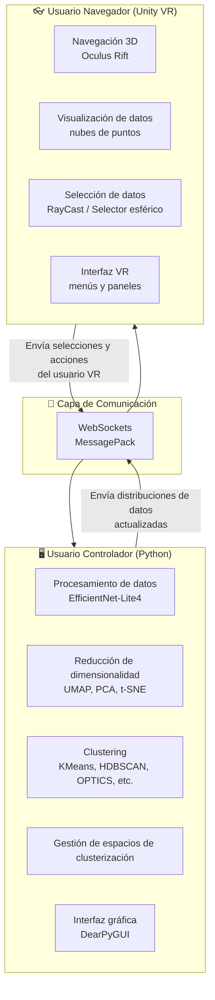

# Dataverse: Una aplicación colaborativa para visualización y *clustering* de datos en Realidad Virtual

Dataverse es una aplicación de realidad virtual desarrollada con Unity y Oculus Rift cuyo propósito es permitir la **visualización inmersiva, exploración y análisis colaborativo de datos en 3D**.
El sistema está diseñado para que dos usuarios —un **navegador VR** y un **controlador en PC**— puedan analizar y refinar conjuntos de datos de manera conjunta, combinando técnicas modernas de *dimensionality reduction* y *clustering* con interacción inmersiva en un entorno virtual.

Este repositorio contiene la aplicación del **usuario navegador (VR)**. La aplicación del **usuario controlador (Python)** está disponible en:
👉 [https://github.com/joaquin30/dataverse-controller](https://github.com/joaquin30/dataverse-controller)

## Propósito del proyecto

Dataverse aborda las limitaciones de las visualizaciones tradicionales en 2D, que dificultan la interpretación de relaciones complejas en datos multidimensionales. Para ello:

* **Aprovecha la realidad virtual** para representar datos inmersivamente en 3D.
* Permite la **exploración intuitiva** de patrones, clusters y distribuciones.
* Introduce un enfoque **colaborativo**, donde:

  * El **usuario controlador** procesa y transforma los datos.
  * El **usuario navegador** los explora y selecciona en VR.
* Sincroniza ambos roles en tiempo real mediante comunicación en red.
* Facilita el aprendizaje, análisis interactivo y experimentación con algoritmos modernos.

## Créditos
- Bruno Fernandez Gutierrez (bruno.fernandez@ucsp.edu.pe)
- Joaquin Pino Zavala (joaquin.pino@ucsp.edu.pe)
- Fredy Quispe Neira (fredy.quispe@ucsp.edu.pe)

# Funcionamiento general del sistema

Dataverse está compuesto por dos módulos que se comunican en tiempo real:

### **1. Usuario Navegador (VR) – Unity + Oculus Rift**

* Visualiza conjuntos de datos como nubes de puntos en 3D.
* Examina clusters, inspecciona imágenes asociadas y realiza selecciones (individuales o grupales).
* Navega libremente por el entorno 3D.
* Recibe distribuciones actualizadas de datos según los algoritmos ejecutados por el controlador.

### **2. Usuario Controlador (PC) – Python**

* Procesa imágenes mediante EfficientNet-Lite4 generando vectores de características.
* Aplica algoritmos como:

  * PCA, UMAP, t-SNE (reducción de dimensionalidad)
  * KMeans, HDBSCAN, OPTICS, Spectral (clustering)
* Crea, edita y administra espacios de clusterización.
* Envía los resultados al usuario VR.
* Recibe selecciones del navegador para refinar el análisis.

### **3. Comunicación en red**

Ambas aplicaciones se sincronizan mediante:

* **WebSockets**: transmisión en tiempo real.
* [MessagePack](https://github.com/msgpack/msgpack-python/): formato binario eficiente para mensajes.

# Arquitectura del Sistema

La arquitectura está organizada en una estructura **cliente-servidor colaborativa**, donde:

* El **usuario controlador** actúa como *servidor*.
* El **usuario navegador** funciona como *cliente VR*.
* La comunicación es **bidireccional**, permitiendo sincronización completa del estado.

### **Diagrama de arquitectura:**


```mermaid
flowchart TB
    subgraph Controller["🖥️ Usuario Controlador (Python)"]
        P1[Procesamiento de datos<br/>EfficientNet-Lite4]
        P2[Reducción de dimensionalidad<br/>UMAP, PCA, t-SNE]
        P3[Clustering<br/>KMeans, HDBSCAN, OPTICS, etc.]
        P4[Gestión de espacios de clusterización]
        P5[Interfaz gráfica<br/>DearPyGUI]
    end

    subgraph NetworkLayer["🔗 Capa de Comunicación"]
        WS[WebSockets<br/>MessagePack]
    end

    subgraph Navigator["👓 Usuario Navegador (Unity VR)"]
        U1[Navegación 3D<br/>Oculus Rift]
        U2[Visualización de datos<br/>nubes de puntos]
        U3[Selección de datos<br/>RayCast / Selector esférico]
        U4[Interfaz VR<br/>menús y paneles]
    end

    Controller -->|Envía distribuciones de datos<br/>actualizadas| WS
    WS --> Navigator

    Navigator -->|Envía selecciones y acciones<br/>del usuario VR| WS
    WS --> Controller
```

### **Componentes principales**

| Componente                      | Descripción                                                                                     |
| ------------------------------- | ----------------------------------------------------------------------------------------------- |
| **Unity HMD Client (VR)**       | Renderiza el entorno 3D y permite la interacción mediante controladores Oculus.                 |
| **Python Control Panel**        | Ejecuta algoritmos, administra datos y sincroniza cambios con el cliente VR.                    |
| **Network Layer**               | WebSockets + MessagePack, transporte de datos eficiente.                                        |
| **Data Processing Engine**      | Implementado en Python, convierte imágenes a vectores, ejecuta algoritmos y administra estados. |
| **Visualization Layer (Unity)** | Representa puntos, clusters, etiquetas y espacios de análisis.                                  |

# Tecnologías utilizadas

### **Realidad Virtual y Rendering**

* **Unity 2022.3.24f1**
* **XR Interaction Toolkit**
* **Oculus SDK / OpenXR**

### **Procesamiento y análisis de datos (Usuario Controlador)**

* **Python 3**
* [EfficientNet-Lite4](https://github.com/RangiLyu/EfficientNet-Lite) (extracción de características)
* **UMAP**, **t-SNE**, **PCA** para reducción de dimensionalidad
* **HDBSCAN**, **KMeans**, **OPTICS**, **Spectral Clustering**
* **DearPyGUI** (interfaz gráfica)
* **NumPy**, **scikit-learn**, **matplotlib**

### **Comunicación en red**

* **WebSockets** (bidireccional, tiempo real)
* **MessagePack** (serialización binaria compacta)

### **Hardware**

* **Oculus Rift + controladores**
* PCs conectadas en red local

# Cómo Descargar y Ejecutar el Proyecto de Unity desde GitHub para Oculus Rift

Esta guía te llevará a través de los pasos para descargar un proyecto de Unity desde GitHub y ejecutarlo en tu máquina local con soporte para Oculus Rift.

## Requisitos Previos
- [Git](https://git-scm.com/) instalado en tu máquina.
- [Unity](https://unity.com/)(v2022.3.24f1) instalado en tu máquina.
- [Oculus Rift](https://www.oculus.com/rift/) y sus controladores configurados en tu sistema.

## Pasos

1. **Clonar el Repositorio:**
   - Abre tu terminal o símbolo del sistema.
   - Navega al directorio donde deseas descargar el proyecto.
   - Ejecuta el siguiente comando:
     ```
     git clone https://github.com/Nyanzey/Dataverse-Navigator.git
     ```

2. **Abrir el Proyecto en Unity:**
   - Inicia Unity Hub.
   - Haz clic en la pestaña "Proyectos".
   - Haz clic en "Agregar" y navega al directorio donde clonaste el repositorio.
   - Selecciona la carpeta del proyecto y haz clic en "Abrir".

3. **Configurar Preferencias de Unity:**
   - El proyecto utiliza versiones específicas de Unity y configuraciones particulares, Unity Hub te solicitará que las instales o ajustes la configuración en consecuencia.

4. **Configurar Ajustes del Proyecto (si es necesario):**
   - Es posible que necesites configurar ajustes como la orientación de la plataforma, ajustes de entrada, etc. Estos ajustes suelen encontrarse en el Editor de Unity bajo "Editar" > "Ajustes del Proyecto".

5. **Configurar Oculus Rift en Unity:**
   - Ve a "Editar" > "Configuración del Proyecto" en el Editor de Unity.
   - Selecciona la pestaña "Reproducción" y asegúrate de que "Oculus" esté seleccionado como dispositivo de realidad virtual.
   - Configura otras opciones de Oculus Rift según sea necesario.

6. **Ejecutar el Proyecto:**
   - Una vez que el proyecto esté abierto en Unity y configurado para Oculus Rift, puedes ejecutarlo haciendo clic en el botón de reproducción en la parte superior del Editor de Unity.
   - Asegúrate de tener conectado tu Oculus Rift y sus controladores antes de ejecutar el proyecto.

7. **Explorar y Modificar:**
   - Ahora tienes el proyecto ejecutándose localmente en tu máquina con soporte para Oculus Rift.

## Notas Adicionales
- Asegúrate de seguir las instrucciones específicas proporcionadas en el README.
- Si encuentras algún problema, consulta el rastreador de problemas del proyecto en GitHub o busca ayuda del equipo.

# Características

## Menú de incio


## Múltiples espacios de clusterización


## Interfaz de control para usuario


## Selección e inspección de puntos


## Estado sincronizado entre navegador y controlador

### Vista de navegador


### Vista de controlador


