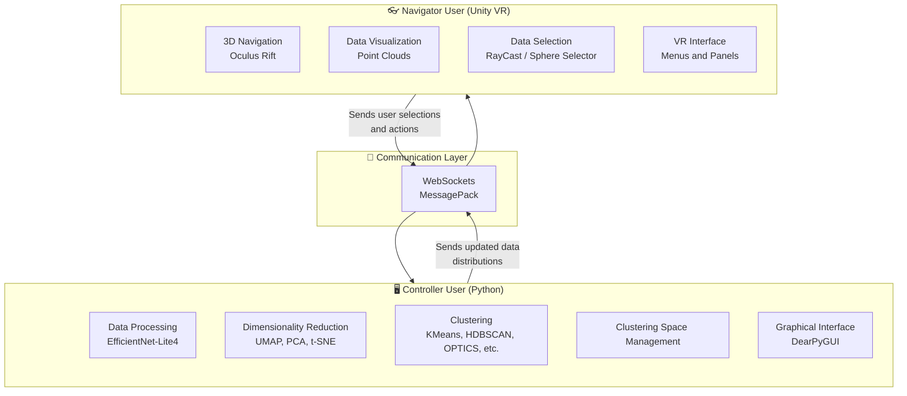
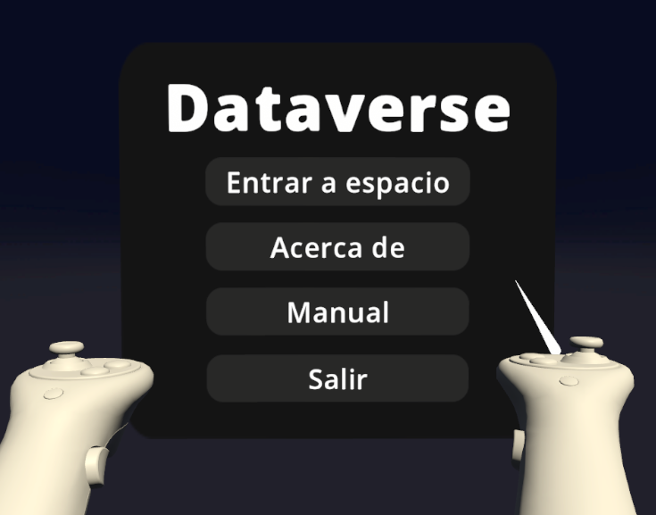
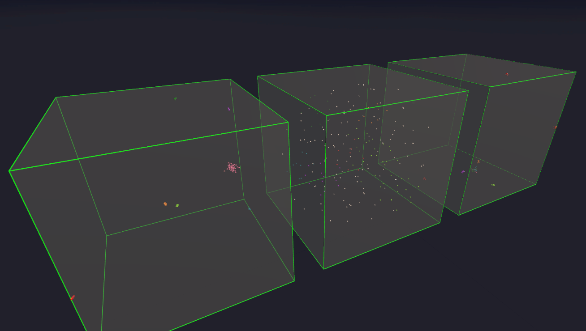
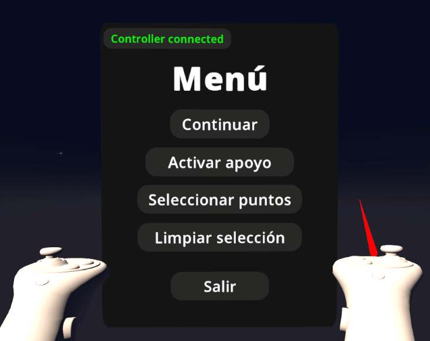
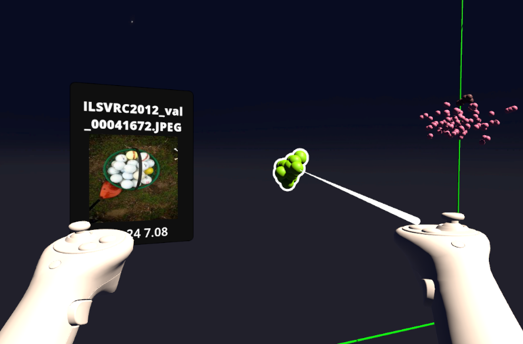
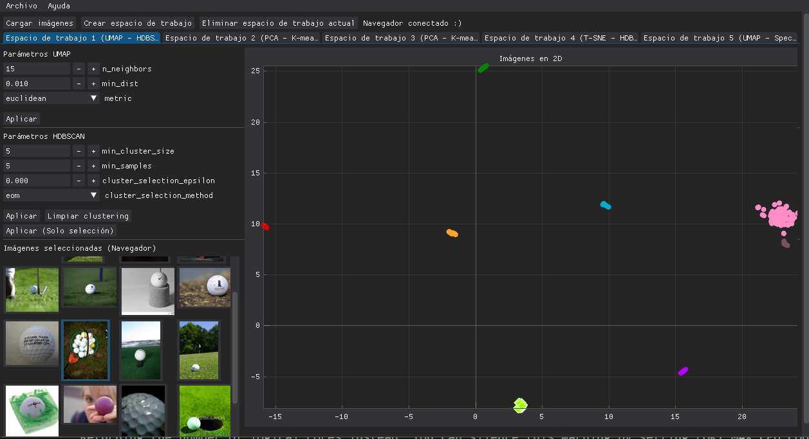

# Dataverse: A Collaborative Application for Data Visualization and *Clustering* in Virtual Reality

Dataverse is a virtual reality application developed with Unity and Oculus Rift, designed to enable **immersive visualization, exploration, and collaborative analysis of multidimensional data in 3D**.
The system allows two users —a **VR navigator** and a **PC-based controller**— to jointly analyze and refine datasets by combining modern dimensionality reduction and clustering techniques with immersive interaction in a virtual environment.

This repository contains the **VR navigator** application. The **controller** application (Python) is available at:
👉 [https://github.com/joaquin30/dataverse-controller](https://github.com/joaquin30/dataverse-controller)

---

## Project Purpose

Dataverse addresses the limitations of traditional 2D data visualizations, which often make it difficult to interpret complex relationships in high-dimensional datasets. To overcome these issues, Dataverse:

* **Leverages virtual reality** to represent data immersively in 3D.
* Enables **intuitive exploration** of patterns, clusters, and distributions.
* Introduces a **collaborative workflow**, where:

  * The **controller user** processes and transforms the data.
  * The **navigator user** explores and selects the data in VR.
* Synchronizes both roles in real time through a network communication layer.
* Facilitates learning, interactive analysis, and experimentation with modern algorithms.

---

## Credits

* Bruno Fernandez Gutierrez ([bruno.fernandez@ucsp.edu.pe](mailto:bruno.fernandez@ucsp.edu.pe))
* Joaquin Pino Zavala ([joaquin.pino@ucsp.edu.pe](mailto:joaquin.pino@ucsp.edu.pe))
* Fredy Quispe Neira ([fredy.quispe@ucsp.edu.pe](mailto:fredy.quispe@ucsp.edu.pe))

---

# System Overview

Dataverse consists of two modules that communicate in real time:

### **1. Navigator User (VR) – Unity + Oculus Rift**

* Visualizes datasets as 3D point clouds.
* Examines clusters, inspects associated images, and performs individual or group selections.
* Navigates freely through the 3D virtual environment.
* Receives updated data distributions based on algorithms executed by the controller.

### **2. Controller User (PC) – Python**

* Processes images using EfficientNet-Lite4 to generate feature vectors.
* Applies algorithms such as:

  * PCA, UMAP, t-SNE (dimensionality reduction)
  * KMeans, HDBSCAN, OPTICS, Spectral Clustering (clustering)
* Creates, edits, and manages clustering spaces.
* Sends results to the VR navigator.
* Receives user selections from the navigator to refine the analysis.

### **3. Network Communication**

Both applications stay synchronized through:

* **WebSockets**: real-time communication
* **MessagePack**: efficient binary serialization format

---

# System Architecture

The architecture follows a **collaborative client–server model**, where:

* The **controller user** operates as the *server*.
* The **VR navigator** functions as the *VR client*.
* Communication is **bidirectional**, ensuring complete state synchronization.

### **Architecture Diagram**



### **Main Components**

| Component                  | Description                                                                  |
| -------------------------- | ---------------------------------------------------------------------------- |
| **Unity HMD Client (VR)**  | Renders the 3D environment and enables interaction using Oculus controllers. |
| **Python Control Panel**   | Executes algorithms, manages data, and synchronizes updates with the VR app. |
| **Network Layer**          | WebSockets + MessagePack for efficient real-time data transfer.              |
| **Data Processing Engine** | Converts images to vectors, runs algorithms, and manages dataset states.     |
| **Visualization Layer**    | Renders points, clusters, labels, and clustering spaces in Unity.            |

---

# Technologies Used

### **Virtual Reality & Rendering**

* Unity 2022.3.24f1
* XR Interaction Toolkit
* Oculus SDK / OpenXR

### **Data Processing (Controller User)**

* Python 3
* EfficientNet-Lite4 (feature extraction)
* UMAP, t-SNE, PCA (dimensionality reduction)
* HDBSCAN, KMeans, OPTICS, Spectral Clustering
* DearPyGUI (UI)
* NumPy, scikit-learn, matplotlib

### **Network Communication**

* WebSockets (real-time bidirectional communication)
* MessagePack (compact binary serialization)

### **Hardware**

* Oculus Rift + controllers
* Local network-connected PCs

---

# How to Download and Run the Unity Project for Oculus Rift

This guide will walk you through downloading the Unity project from GitHub and running it locally with Oculus Rift support.

## Prerequisites

* [Git](https://git-scm.com/) installed on your machine
* [Unity](https://unity.com/) (v2022.3.24f1) installed
* [Oculus Rift](https://www.oculus.com/rift/) properly configured

## Steps

1. **Clone the Repository**

   ```bash
   git clone https://github.com/Nyanzey/Dataverse-Navigator.git
   ```

2. **Open the Project in Unity**

   * Launch Unity Hub
   * Go to **Projects → Add**
   * Select the cloned folder
   * Open the project

3. **Unity Configuration**

   * Unity Hub may prompt to install the correct Unity version—follow the instructions.

4. **Project Settings (if necessary)**

   * Configure platform orientation, XR settings, or input settings as needed under
     **Edit → Project Settings**.

5. **Configure Oculus Rift**

   * Go to **Edit → Project Settings**
   * Under **XR Plug-in Management**, ensure **Oculus** is enabled
   * Adjust any additional VR or Oculus options if required

6. **Run the Project**

   * Click the Play button in Unity
   * Make sure your Oculus Rift and controllers are connected

7. **Explore and Modify**

   * You can now interact with the project locally using your Oculus Rift.

---

# Features

## Start Menu



## Multiple Clustering Spaces



## User Interface (Navigator)



## Point Selection and Inspection



## Synchronized State Between Navigator and Controller

### Navigator View


### Controller View


